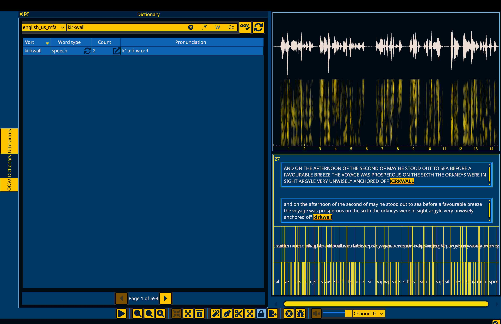

.. _`LibriSpeech data set`: https://drive.google.com/open?id=1MNlwIv5VyMemrXcZCcC6hENSZpojkdpm

.. _examples:

********
Examples
********

.. warning::

   Under construction

.. _alignment_example:

Example 1: Alignments in LibriSpeech (English)
==============================================

.. note::

   This example mirrors the example in
   `the MFA alignment example <https://montreal-forced-aligner.readthedocs.io/en/latest/first_steps/example.html#example-1-aligning-librispeech-english>`_.

Set up
------

1. Ensure you have installed Anchor via :ref:`installation`.
2. Ensure you have downloaded the pretrained model via :code:`mfa model download acoustic english_mfa`
3. Ensure you have downloaded the pretrained US english dictionary via :code:`mfa model download dictionary english_us_mfa`
4. Download the prepared LibriSpeech dataset (`LibriSpeech data set`_) and extract it somewhere on your computer

Aligning the corpus using MFA
-----------------------------

In the same environment that you've installed MFA, enter the following command into the terminal:

.. code-block:: bash

   mfa align /path/to/librispeech/dataset english_us_mfa english_mfa ~/Documents/aligned_librispeech --clean --use_postgres

Note the use of ``--clean`` and ``--use_postgres``.  Anchor can only interface with MFA runs that use PostGreSQL databases rather than the default SQLite.

.. note::

   If you would like to always use the PostGreSQL backend for MFA, you can run:

   .. code-block:: bash

      mfa configure --enable_use_postgres

Loading the corpus
------------------

In a terminal with the conda environment created in :ref:`installation` activated enter the following:

.. code-block:: bash

   mfa anchor

Once Anchor starts, navigate to the "Corpus" menu:

From the Corpus menu, select "Load a corpus":

In the pop up, navigate to where you saved the Librispeech demo dataset that you downloaded.
Importantly, this is the input corpus directory that you downloaded and extracted, NOT the aligned output directory.

Once the corpus has loaded, you can select an utterance to view both the input transcriptions in the top text box and the alignment tiers.

Next steps
----------

Alignment quality analysis
~~~~~~~~~~~~~~~~~~~~~~~~~~

From here, you have a corpus that you can inspect to find and correct issues.
One possible next step to improve the alignments would be to find files that perform poorly on alignment quality metrics that can be indicative of issues with the transcript, dictionary, or audio file.
Clicking on the headers for Log-likelihood, Phone duration deviation, or SNR will sort the utterances accordingly.

.. seealso::

   See `Analyzing alignment quality in the MFA docs <https://montreal-forced-aligner.readthedocs.io/en/latest/user_guide/implementations/alignment_analysis.html>`_
   for details on how these metrics are calculated and what they can indicate.

Finding Out-of-Vocabulary items (OOVs)
~~~~~~~~~~~~~~~~~~~~~~~~~~~~~~~~~~~~~~

Another next step for improving the alignments is improving the coverage of the dictionary.  To open up the OOVs window, go to the "Window" menu in the menubar:

Once the OOVs window is open, you can navigate to it on the left hand side, and sort by count descending by clicking the "Count" header to get the most frequent OOV items.

Double clicking on the count field for any OOV item will search the corpus for that word and open up the utterances pane with the results.

Fixing Out-of-Vocabulary items (OOVs)
~~~~~~~~~~~~~~~~~~~~~~~~~~~~~~~~~~~~~

If you'd like to add a pronunciation to dictionary, you can either enter them manually, or use a G2P model.  To use a G2P model, first go to the "Models" menu in the menubar, followed by "Download G2P model" and then select "english_us_mfa", as this corresponds to the dictionary we've aligned with.

Once the file is downloaded, ensure it's loaded for use by going to "Models" in the menubar, followed by "Load G2P model" and selecting the "english_us_mfa" model that was downloaded.

Now that the G2P model is loaded, right click on any row in the OOVs window to bring up a context menu and select the "Add pronunciation" option.

This will open the Dictionary window on the left hand side filtered to the word that was just added.  The default pronunciation will be filled from the G2P model's generation.

.. note::

   If a G2P model is not loaded, then the word will receive a pronunciation using the OOV phone ("spn").  You can still edit this transcription manually and specify the necessary pronunciation.

In the case of "kirkwall" above, the G2P generation is good, but for some other OOV items, you may need to edit the pronunciation.  To do so, double click on the pronunciation field of the word (or click one and hit "enter"), and it will become an editable field.

Additionally, given MFA's support and use of symbols and diacritics not easily typed on standard keyboards, there is a keyboard button on the right hand side of the edit field.
Pressing the button will open a dropdown with all the symbols that the dictionary uses that you can select from.
You can also type normally in the pronunciation field while the keyboard dropdown is open.

When you're satisfied with the pronunciation, you can hit return again or the checkmark button.

.. note::

   The pronunciation edit field is validated so that pronunciations you add can only include phone symbols that are in the dictionary. You will not be able to save entries that contain new phones.

Finally, if you'd like to save any changes to the dictionary, go to the "Dictionary" menu in the menubar and select "Save dictionary".

.. warning::

   Saving the dictionary will overwrite the original dictionary, I recommend having back ups or version control for dictionary files when modifying them through Anchor.