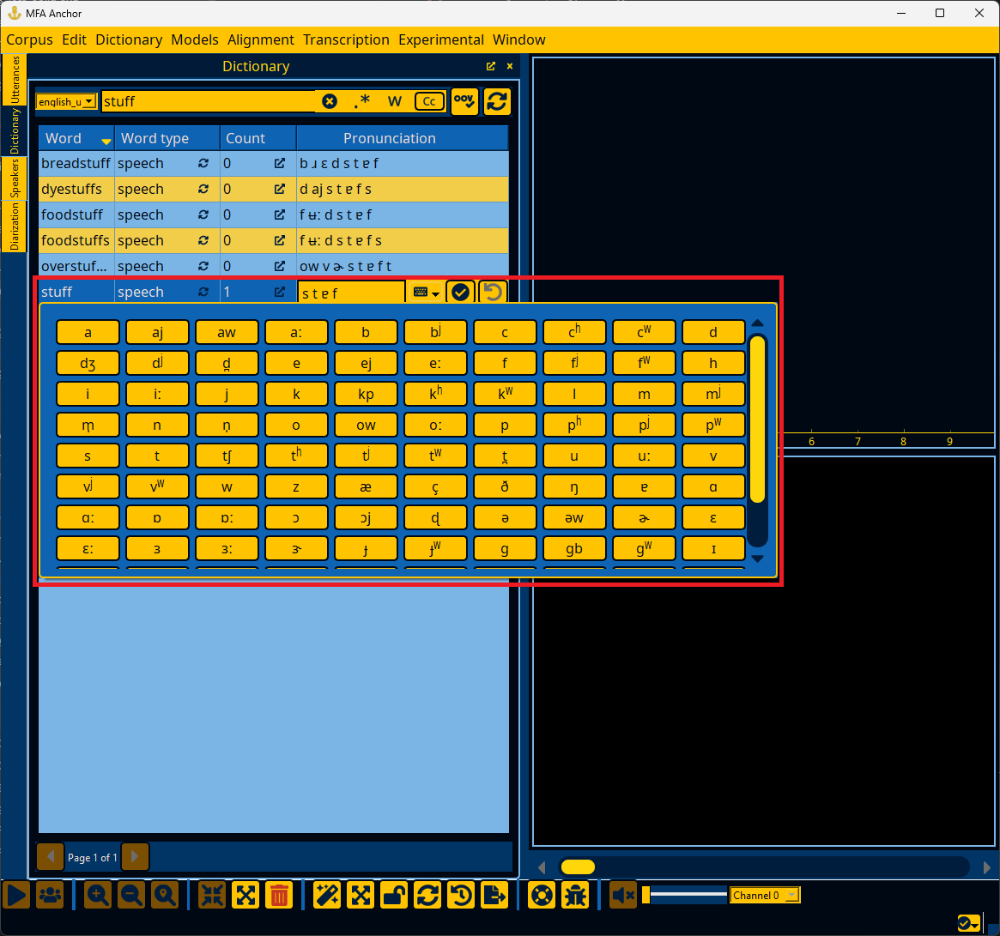

.. _first_steps:

***********
First steps
***********

Use cases
=========

There are several broad use cases that you might want to use Anchor for.  Take a look below and if any are close matches, you should be able to apply the linked instructions to your data.

Correcting transcriptions
-------------------------

You want to correct an existing `speech corpus <https://montreal-forced-aligner.readthedocs.io/en/latest/user_guide/corpus_structure.html>`_.

#. Follow :ref:`first_steps_load_corpus`
#. Refer to :ref:`utterance_interface` for browsing the corpus

Validating corpus with dictionary
---------------------------------

You want to have an existing `speech corpus <https://montreal-forced-aligner.readthedocs.io/en/latest/user_guide/corpus_structure.html>`_ and `pronunciation dictionary <https://montreal-forced-aligner.readthedocs.io/en/latest/user_guide/dictionary.html>`_ and want to validate the dictionary's coverage over the corpus.

#. Follow :ref:`first_steps_load_corpus`
#. Follow :ref:`first_steps_load_dictionary`
#. (Optional but helpful) Follow :ref:`first_steps_load_g2p`
#. Follow :ref:`first_steps_oovs`

Segmentation and diarization
----------------------------

You want to have an existing `speech corpus <https://montreal-forced-aligner.readthedocs.io/en/latest/user_guide/corpus_structure.html>`_ that lacks appropriate speaker metadata and/or utterance boundaries and want to get it into a more usable shape for training an acoustic model or aligning the corpus.

#. Follow :ref:`first_steps_load_corpus`
#. Follow :ref:`first_steps_load_dictionary`
#. Follow :ref:`first_steps_load_ivector_extractor`
#. Follow :ref:`first_steps_diarization`

Validating alignments
---------------------

You want to have an existing `speech corpus <https://montreal-forced-aligner.readthedocs.io/en/latest/user_guide/corpus_structure.html>`_, `pronunciation dictionary <https://montreal-forced-aligner.readthedocs.io/en/latest/user_guide/dictionary.html>`_, and `acoustic model <https://mfa-models.readthedocs.io/en/latest/acoustic/index.html>`_, but MFA reports many unaligned files or the alignment quality is poor when spot checking.

#. Follow :ref:`first_steps_load_corpus`
#. Follow :ref:`first_steps_load_dictionary`
#. Follow :ref:`first_steps_load_acoustic_model`
#. Follow :ref:`first_steps_alignment`

Generating transcriptions
-------------------------

You want to have a `speech corpus <https://montreal-forced-aligner.readthedocs.io/en/latest/user_guide/corpus_structure.html>`_ with no transcriptions or some utterances missing transcriptions, but have an `acoustic model <https://mfa-models.readthedocs.io/en/latest/acoustic/index.html>`_, `pronunciation dictionary <https://montreal-forced-aligner.readthedocs.io/en/latest/user_guide/dictionary.html>`_, and `language model <https://mfa-models.readthedocs.io/en/latest/language_model/index.html>`_.

#. Follow :ref:`first_steps_load_corpus`
#. Follow :ref:`first_steps_load_dictionary`
#. Follow :ref:`first_steps_load_acoustic_model`
#. Follow :ref:`first_steps_load_language_model`
#. Follow :ref:`first_steps_transcription`

Steps
=====

.. _first_steps_load_corpus:

Loading a corpus
----------------

In the Corpus menu, select "Load a corpus" and navigate to the corpus's directory.

.. figure:: ../_static/img/corpus_menu_load_recent.png
   :align: center

.. important::

   Only corpora in the format that MFA expects can be properly loaded.  See `MFA's corpus format documentation <https://montreal-forced-aligner.readthedocs.io/en/latest/user_guide/corpus_structure.html>`_ for full details.

.. _first_steps_load_dictionary:

Loading a dictionary
--------------------

In the Dictionary menu, select "Load a dictionary" and navigate to the dictionary's path.  If you would like to use a pretrained dictionary from `MFA models <https://mfa-models.readthedocs.io/>`_, you can download it via the "Download dictionary" submenu, and then select it from the "Load a saved dictionary" submenu.

.. figure:: ../_static/img/dictionary_menu.png
   :align: center

.. important::

   See `MFA's dictionary format documentation <https://montreal-forced-aligner.readthedocs.io/en/latest/user_guide/dictionary.html>`_ for how a pronunciation dictionary should be formatted if you are loading your dictionary.

.. _first_steps_load_acoustic_model:

Loading an acoustic model
-------------------------

In the Models menu, select "Load acoustic model" and navigate to the acoustic model's path.  If you would like to use a pretrained acoustic model from `MFA models <https://mfa-models.readthedocs.io/>`_, you can download it via the "Download acoustic model" submenu, and then select it from the "Load acoustic model" submenu.

.. _first_steps_load_language_model:

Loading a language model
------------------------

In the Models menu, select "Load language model" and navigate to the language model's path.  If you would like to use a pretrained language model from `MFA models <https://mfa-models.readthedocs.io/>`_, you can download it via the "Download language model" submenu, and then select it from the "Load language model" submenu.

.. _first_steps_load_g2p:

Loading a G2P model
-------------------

In the Models menu, select "Load G2P model" and navigate to the G2P model's path.  If you would like to use a pretrained G2P model from `MFA models <https://mfa-models.readthedocs.io/>`_, you can download it via the "Download G2P model" submenu, and then select it from the "Load G2P model" submenu.

.. _first_steps_load_ivector_extractor:

Loading an ivector extractor
----------------------------

In the Models menu, select "Load ivector extractor" and navigate to the ivector extractor's path.  If you would like to use a pretrained ivector extractor from `MFA models <https://mfa-models.readthedocs.io/>`_, you can download it via the "Download ivector extractor" submenu, and then select it from the "Load ivector extractor" submenu.

.. _first_steps_oovs:

Analyzing and improving dictionary coverage
-------------------------------------------

Once a dictionary is loaded (:ref:`first_steps_load_dictionary`), you can go to the "Window" menu and select "Dictionary" and "OOVs".  The Dictionary panel will show you all words in the dictionary, their pronunciations, and how many instances were found in the corpus.  The OOVs panel will show all the out-of-vocabulary items for words that were in the corpus, but not the pronunciation dictionary.  If you double click the counts :fa:`up-right-from-square;sd-text-secondary` of an OOV item, the Utterances panel will pop up and show all utterances that have this OOV item.

.. note::

   See :ref:`dictionary_interface` and :ref:`oov_interface` for more details on interacting with the dictionary window and OOV window, respectively.

If you would like to add a pronunciation for an OOV word, you can right click the word either in the utterance's text edit on the main screen, or the word in the OOVs table.  If a G2P model is loaded (see :ref:`first_steps_load_g2p`), then the G2P model will provide its best guess for the pronunciation, otherwise the default pronunciation will be the OOV phone.

Double clicking any pronunciation in the Dictionary panel will allow you to edit the pronunciation, either with direct input, or via a pop up "keyboard" that has all the phone symbols in the dictionary.  If a phone symbol is entered without being present in other words, the pronunciation will not be able to be saved, to prevent typos from entering the dictionary.

.. _first_steps_diarization:

Improving speaker metadata
--------------------------

If an ivector extractor model is loaded (:ref:`first_steps_load_ivector_extractor`), Anchor can analyze utterance and speaker ivectors for any issues in speaker metadata.  Corpora commonly have issues where an utterance belongs to the wrong speaker, two speakers in the corpus are actually the same speaker, or no utterances have speaker information.  To begin diarization, go to the "Window" menu and select "Diarization".

.. note::

   See :ref:`diarization_interface` for more details on interacting with the diarization window.

In the Diarization panel, ivectors can be extracted via the "Refresh ivectors" button. The "Reset ivectors" button deletes existing ivector information (useful if changing the ivector model), whereas "Refresh ivectors" will only calculate ivectors for utterances/speakers that have been modified.

.. important::

   What threshold you use should be based on getting a sense of manually merging speakers first, particularly for noisy corpora.  I have had reasonable success using 0.15 as a threshold for large scale merging.

Additionally, you can use the "Cluster utterances" or "Classify speakers" under the "Experimental" menu to do a more whole-scale recalculation of speakers.  Be warned that this will discard most existing speaker metadata.  It will label new speaker clusters based on the most common speaker in that cluster from the original speaker labels, but otherwise this is a destructive operation within Anchor (though the files on disk will remain unchanged until they are exported, see :ref:`export_data`).

.. note::

   See the `MFA documentation on diarize_speakers <https://montreal-forced-aligner.readthedocs.io/en/latest/user_guide/corpus_creation/diarize_speakers.html>`_ for more information on clustering utterances into new speakers.

.. _first_steps_alignment:

Spot-checking alignment
-----------------------

If a pronunciation dictionary and acoustic model are loaded (see :ref:`first_steps_load_dictionary` and :ref:`first_steps_load_acoustic_model`), then Anchor can perform forced alignment using MFA and visually represent the word and phone alignments.  To begin alignment, go to the "Window" menu and select "Alignment" to open the Alignment panel.

In the Alignment panel, there are options that can be filled in for beam, retry beam, silence boost factor, and whether to `fine tune alignments <https://montreal-forced-aligner.readthedocs.io/en/latest/user_guide/implementations/fine_tune.html>`_ and `model cutoff tokens <https://montreal-forced-aligner.readthedocs.io/en/latest/user_guide/dictionary.html#modeling-cutoffs-and-hesitations>`_.

Once alignment completes, you can go the Utterances panel to inspect each utterance.  The utterance will have extra tiers below the text tier for the aligned word and phone intervals.

.. figure:: ../_static/img/utterance_alignment.png
   :align: center

You can sort utterances based on their log-likelihood per frame.  Lower log-likelihood can be the result of errors in the utterance's transcription or the pronunciation available in the dictionary.  However, lower log-likelihood can also be the result of normal variation in how people speak, either at a speaker level, or if a speaker affects a different voice quality (i.e., during story-telling, emphasis, etc).

If an utterance was not able to be aligned, it will not have a log-likelihood.

.. note::

   If you have gold alignments in TextGrid form, they can be loaded via "Load reference alignments" in the "Alignment" menu.  If these reference alignments have a different phone set than the dictionary you are using, you can load a custom mapping in the "Alignment" menu as well.  See  `MFA's documentation on alignment evaluation <https://montreal-forced-aligner.readthedocs.io/en/latest/user_guide/implementations/alignment_evaluation.html#alignment-evaluation>`_ for more details.

.. _first_steps_transcription:

Transcribing utterances
-----------------------

Anchor can generate transcriptions for utterances either for validating their existing transcriptions or generating new text transcriptions for use in training acoustic models.  At a minimum, a pronunciation dictionary and acoustic model must be loaded (see :ref:`first_steps_load_dictionary` and :ref:`first_steps_load_acoustic_model`).  If you want to generate new text transcriptions from scratch, a language model must also be loaded (see :ref:`first_steps_load_language_model`), but it is optional for validating existing transcriptions.  If no language model is loaded, Anchor will generate per-speaker language models from their existing transcriptions (so therefore existing transcriptions are necessary, even if they might not be completely accurate). To begin transcription, go to the "Window" menu and select "Transcription" to open the Transcription panel.

In the Transcription panel, the only option is for specifying the target number of ngrams for the per-speaker language models, which is not applicable if a pretrained language model is loaded.

Once transcription completes, you can go the Utterances panel to inspect each utterance.  The utterance will have an extra tier below the text tier with the transcribed text (along with red background for words that count toward the word error rate of the utterance).  In the Utterances panel, you can sort based on the word error rate (WER) and character error rate (CER) to see where the utterance text and transcribed text differ the most.

.. toctree::
   :maxdepth: 1
   :hidden:

   example