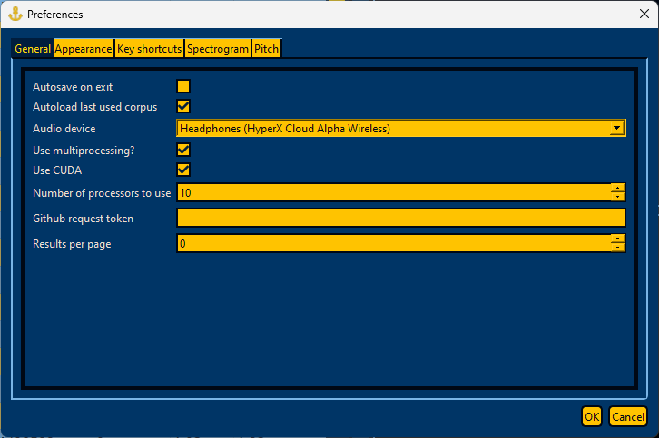
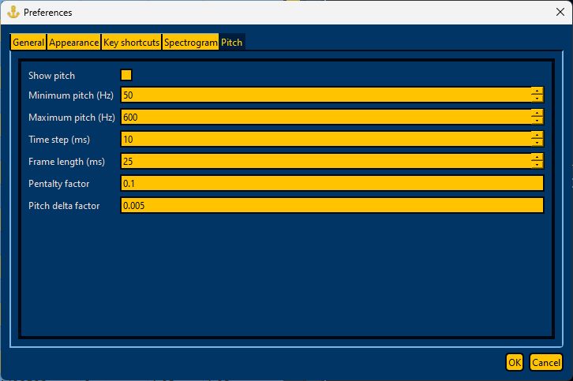

.. _configure_annotator:

******************
Configuring Anchor
******************

You can configure many aspects of Anchor by clicking :code:`Preferences...` in the :code:`Edit` menu.

.. figure:: ../_static/img/edit_menu.png
   :align: center

.. _general_options:

Configuring general options
===========================

Here you can set options related to how MFA is used from Anchor (i.e., multiprocessing, CUDA, number of jobs), along with general interface options.

.. _appearance_options:

Configuring Anchor's appearance
===============================

The default color theme for Anchor can be changed the default "MFA" to a "Praat-like" theme or a user-defined theme for various interface components.

.. _keyboard_shortcuts:

Configuring keyboard shortcuts
==============================

Here you can see the default keyboard shortcuts for various UI actions and change them as necessary.

.. _spectrogram_options:

Configuring the spectrogram
===========================

.. figure:: ../_static/img/preferences_spec.png
   :align: center

Here you can specify facets of spectrogram generation related to dynamic range, number of time steps, maximum frequency, and window size.

.. _pitch_options:

Configuring pitch tracks
========================

Here you can toggle pitch to show it overlaid on the spectrogram along with parameters for the pitch algorithm.

.. seealso::

   Pitch is generated via Kaldi's pitch algorithm, see `compute-kaldi-pitch-feats <https://kaldi-asr.org/doc/compute-kaldi-pitch-feats_8cc.html>`_.
