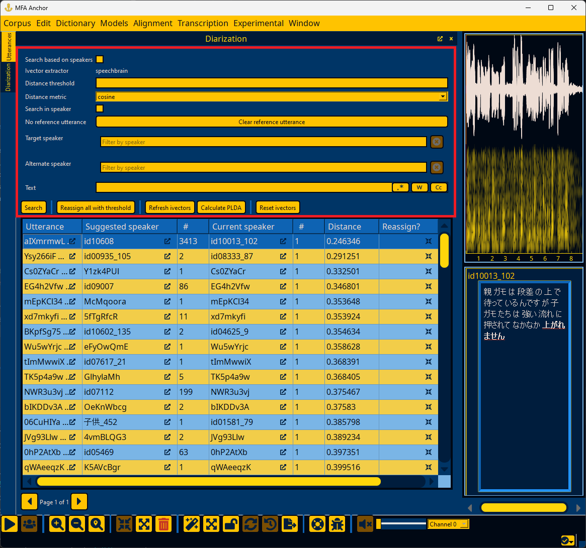

.. _diarization_interface:

*******************
Speaker diarization
*******************

The Diarization window allows for re-assigning utterances to speakers based off of ivectors from an MFA ivector model or from `speechbrain <https://speechbrain.readthedocs.io/en/latest/>`_'s xvector implementation (requires speechbrain to be installed via pip).

As a first step, ivectors must be loaded via the "Refresh ivectors" or "Reset ivectors" once an ivector model is selected.  See :ref:`first_steps_diarization` for more details.

.. figure:: ../_static/img/diarization_interface.png
   :align: center

.. warning::

   There are several functions under the "Experimental" menu that are related to speaker diarization that may be useful, but have no guarantee of working well, so please inspect your data.

.. _diarization_search:

Diarizing speakers
==================

The default search for reassignments looks for single-utterance speakers and finds the closest speaker.  In the search window (highlighted below), you can set:

- A minimum distance threshold for results (i.e., 0.25 for cosine distance will exclude all utterance-speaker matches with cosine distance greater than 0.25)
- Distance metric to either :code:`cosine` or :code:`plda`
- "Search in speaker" will look for utterance outliers in the speaker distribution and find another speaker that is more similar
- Right-clicking an utterance in the results will give an option for setting a reference utterance to use that utterance's ivector rather than using the speaker's mean ivector in searching (useful if you have different registers for a given speaker)
- Target speaker will look for utterances that are most likely to be this speaker
- Alternate speaker will only consider this speaker's utterances (used with Target speaker for disambiguating between two similar speakers)
- Text allows for searching utterance text in case a speaker regularly uses certain words as a way of constraining the search space

.. note::

   Using :code:`plda` as the distance metric requires running "Calculate PLDA" to generate the PLDA model.  PLDA scoring returns a log-likelihood ratio as an affinity metric rather than a distance score, so higher PLDA scores and lower cosine distances are more likely that the utterance was said by the speaker.  The distance threshold parameter will exclude utterance-speaker matches lower than the log-likelihood ratio specified.

Once you click the "Search" button or press enter in any field, a worker will look for likely re-assignments.  This can be a lengthy process (particularly when using :code:`plda` as the metric as there is extra calculations outside of the database compared to :code:`cosine`).  In the bottom right, there is an expandable panel that lists all currently running workers, along with progress towards completion.

.. _diarization_results:

Diarization results
===================

Diarization results give likely utterances that are spoken by suggested speakers.  In addition to these two primary columns, there are columns for the current speaker for the utterance, the utterance counts for each speaker in question, and the distance/PLDA score between the utterance and the suggested speaker's mean.  Finally, there are two actions per row of reassigning the current utterance to the suggested speaker or merging all utterances for the current speaker into the suggested speaker.

Double-clicking the utterance field :fa:`external-link-alt;sd-text-secondary` will load the utterance in the right hand Utterance detail where you can listen to the utterance via the tab key by default (see :ref:`keyboard_shortcuts`).  Double clicking the suggested speaker field :fa:`external-link-alt;sd-text-secondary` or current speaker field :fa:`external-link-alt;sd-text-secondary` will load the speaker's utterance that is closest to their mean ivector.

.. note::

   The various actions available in :ref:`utterance_toolbar` remain available for the selected utterance.
