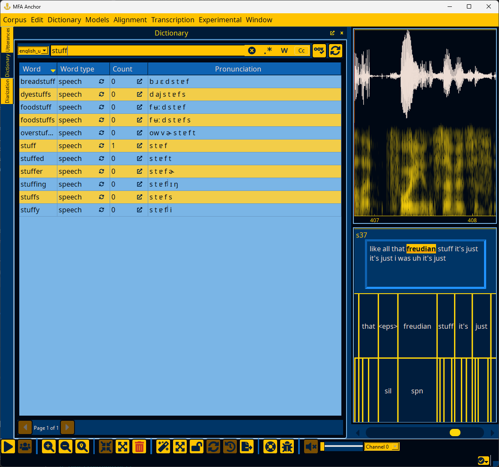
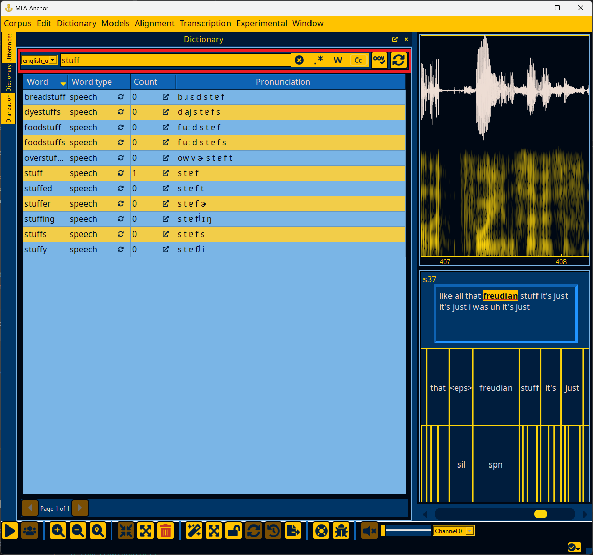
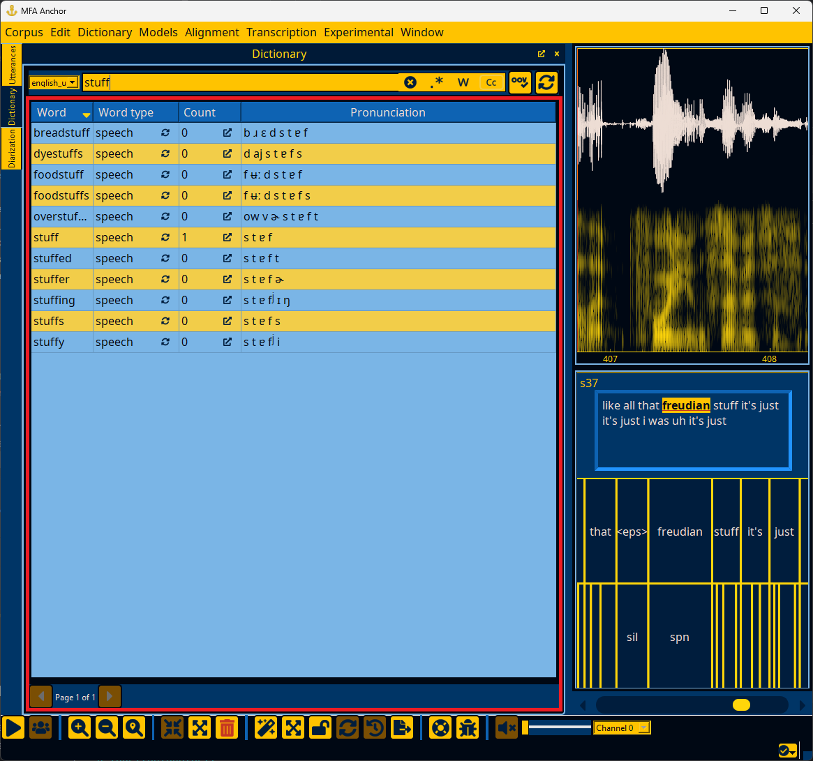
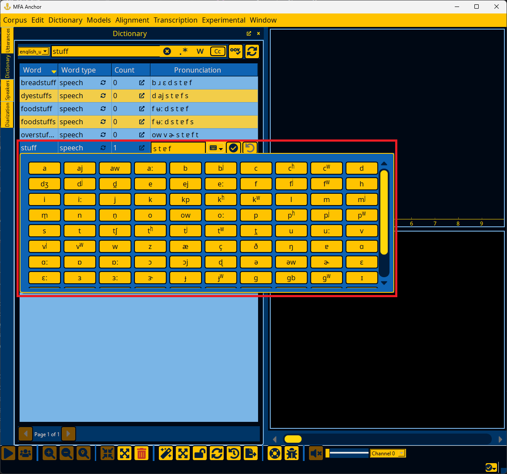
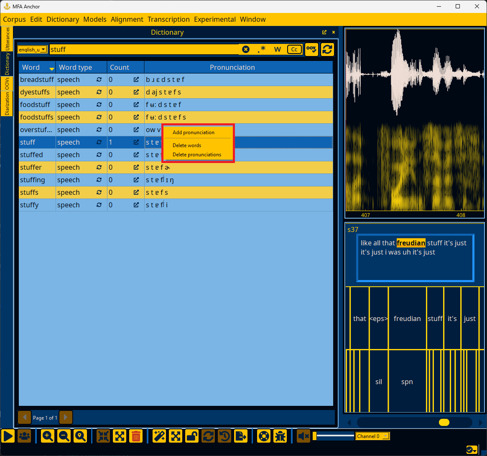

.. _dictionary_interface:

*****************
Dictionary window
*****************

.. warning::

   The dictionary window requires that a dictionary has been loaded for a corpus. See :ref:`first_steps_load_dictionary` for more details.

The dictionary window allows for editing words in the pronunciation dictionary that is loaded for the corpus.

.. _dictionary_search:

Searching the dictionary
========================

You can use the highlighted search bar below to search for words in the dictionary.  In addition to the clear button in the search box, there are buttons for enabling regular expressions, matching full words only, and case sensitivity. Pressing enter in the search box will run the search.

The buttons to the right of the search bar.  The OOV check button will reanalyze the corpus and update counts and any OOVs from editing utterance transcripts.  The :fa:`rotate;sd-text-secondary` button will rebuild lexicon FSTs for use in aligning and splitting single files in :ref:`utterance_toolbar_edit`.

.. _dictionary_results:

Dictionary search results
=========================

By default search results are sorted on the orthographic form, but each column other than "Pronunciation" can be clicked to cycle sorting on it. If you double click the counts :fa:`external-link-alt;sd-text-secondary` of a word, the Utterances window (:ref:`utterance_results`) will pop up and show all utterances that have this word.

The orthographic form and pronunciation can both be edited by double clicking the field.  Editing the pronunciation has extra validation to ensure that no new phone symbols are introduced.  Clicking the :fa:`keyboard;sd-text-secondary` button will bring up a keyboard for adding symbols to the pronunciation.

Right-clicking any pronunciation/word will bring up a context menu for adding a new pronunciation, deleting any selected words, or deleting any selected pronunciations.

