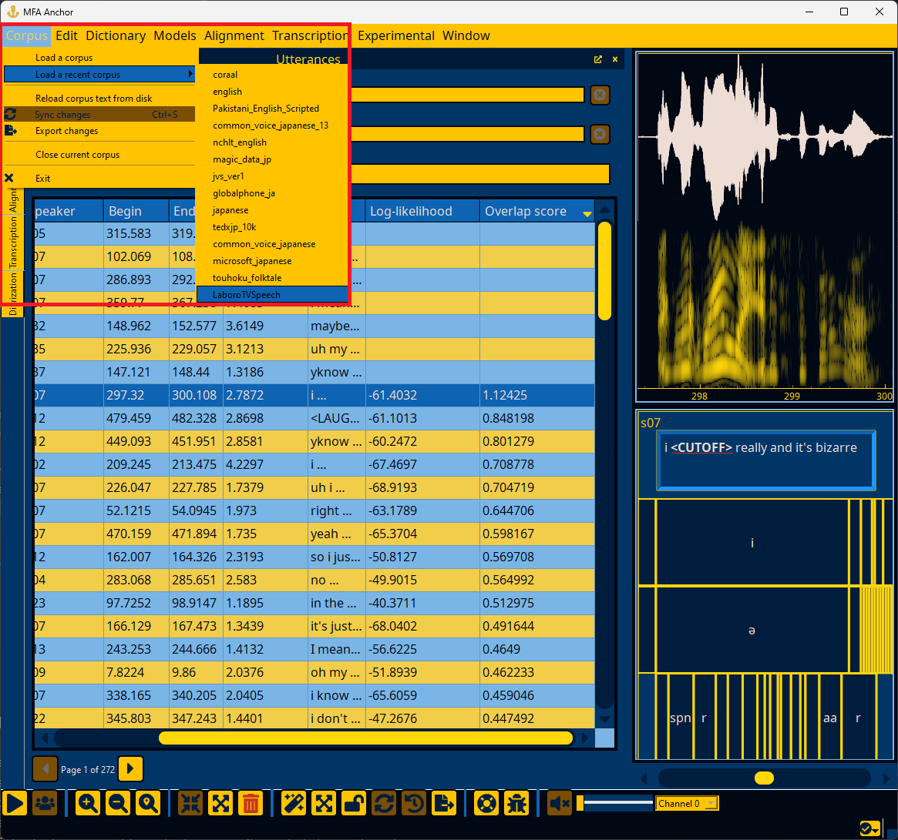
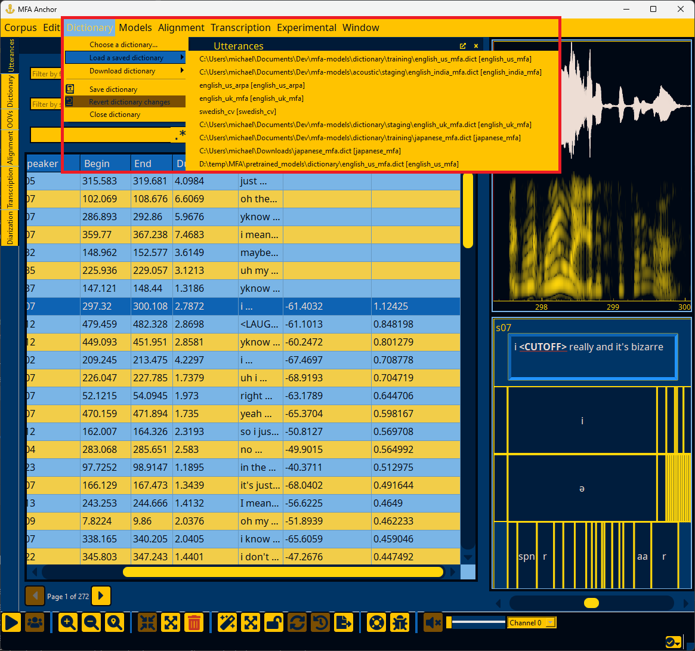
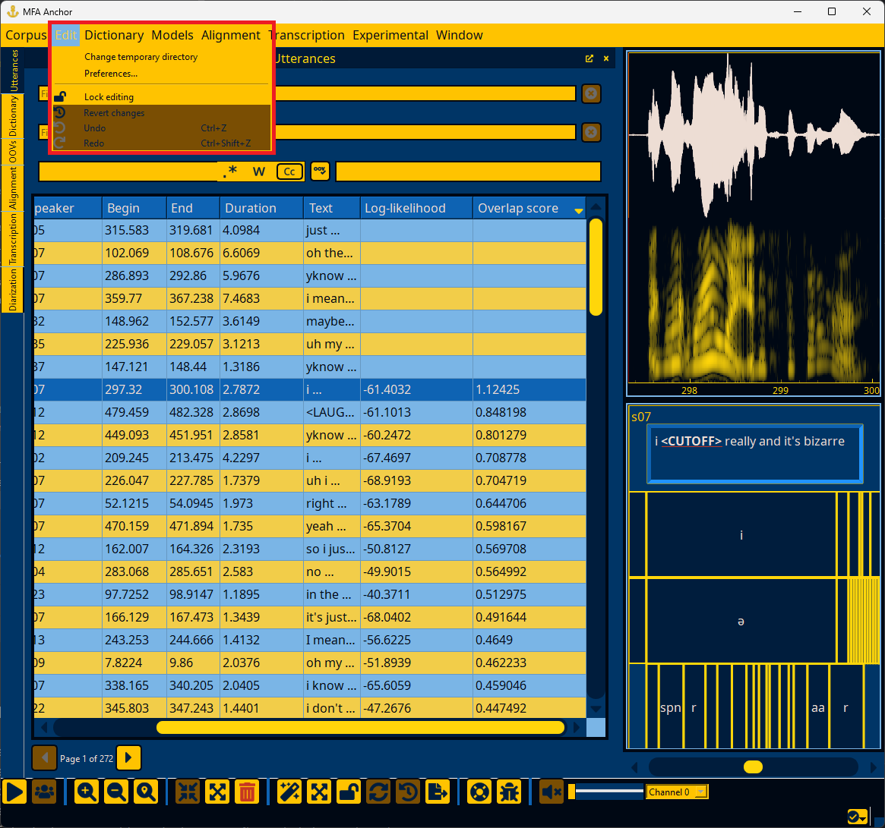

.. _user_guide:

**********
User Guide
**********

.. warning::

   Please back up your data and ideally use version control on transcripts when using Anchor to ensure no data loss occurs.  Anchor is still in alpha and bugs are likely.

Anchor consists of multiple windows for various ways you can inspect and modify the corpus.  The windows listed under the "Window" menu are dock windows that can be separate windows from the core Utterance window, or can be stacked as panes on the left or right side.  All documentation shows these windows as stacked on the left hand side.

.. _export_data:

Exporting data
==============

By default, all changes are saved in a PostgreSQL database, so they will not be reflected in the source files until you manually export the changes.  To export changes, click on ":fa:`file-export;sd-text-secondary` Export changes" in the "Corpus" menu.

.. _save_dictionary:

Saving changes to the dictionary
--------------------------------

Likewise, changes to the pronunciation dictionary are saved only in the PostgreSQL database until you manually save it.  The dictionary can be saved via ":fa:`book;sd-text-secondary` Save dictionary" in the "Dictionary" menu.

.. _reloading_corpus:

Discarding changes
==================

Most actions in Anchor can be undone/redone via the Undo stack.  These can be invoked either through the edit menu below or via ctrl+z/ctrl+shift+z keyboard shortcuts (see :ref:`keyboard_shortcuts` for changing the defaults).

Sometimes you can make changes that are not recoverable (or Anchor can mess up!).  In these cases a more wholesale undo is necessary.  You can reset the corpus to the state it originally was in by clicking "Reload corpus text from disk" in the "Corpus" menu.

.. important::

   As Anchor is in alpha, it is also possible to get into unrecoverable states due to database corruption and not all edge cases are handled by Anchor yet.  I recommend installing `pgAdmin <https://www.pgadmin.org/>`_ so that you delete/drop databases as necessary for corpora.  Once a corpus database is dropped, then restarting Anchor will trigger loading it from scratch (if the "Autoload last used corpus" option is enabled in :ref:`general_options`)

.. toctree::
   :hidden:

   utterances
   dictionary
   oovs
   speakers
   diarization
   configuration
   known_issues
