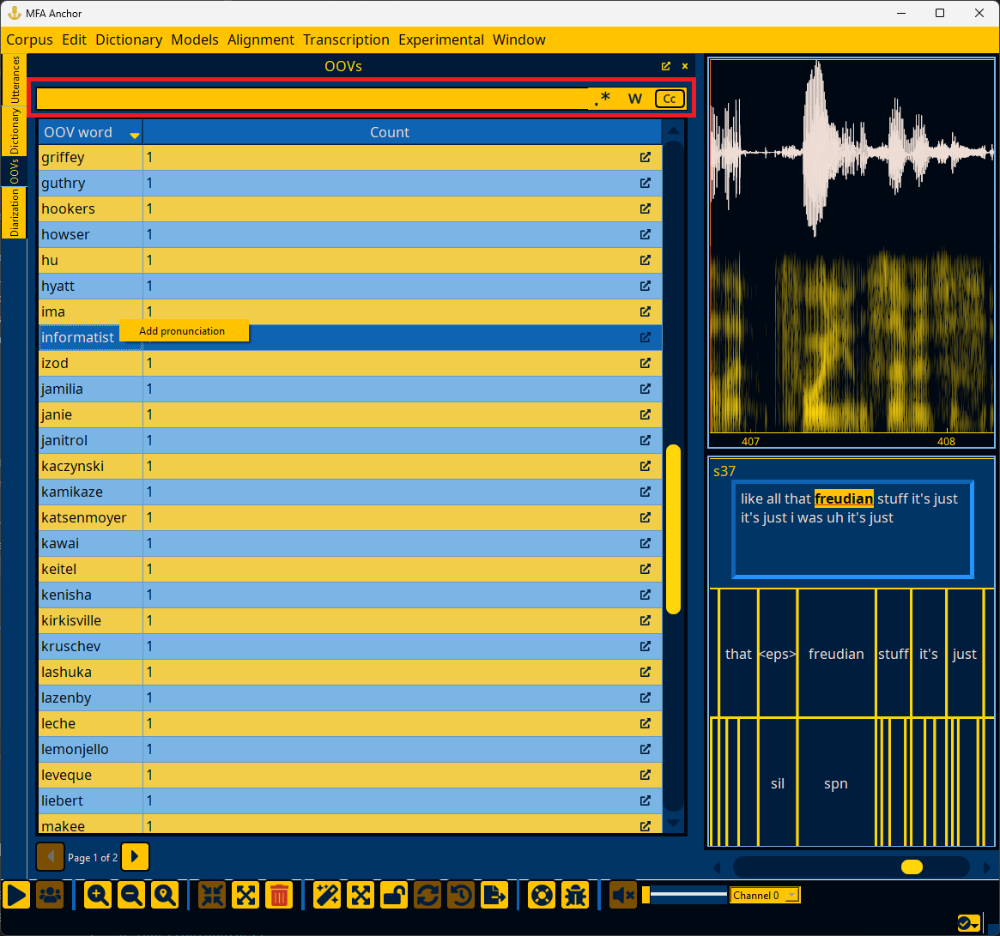

.. _oov_interface:

*************
OOV interface
*************

The OOV interface provides a simple list of words in the corpus that are not in the dictionary (OOV = "Out of Vocabulary").

.. seealso::

   See :ref:`first_steps_oovs` for a workflow for adding OOV items to the dictionary.

.. _oov_search:

Searching OOV words
===================

You can use the highlighted search bar below to search for specific OOVs in the corpus.  In addition to the clear button in the search box, there are buttons for enabling regular expressions, matching full words only, and case sensitivity. Pressing enter in the search box will run the search.

.. _oov_results:

OOV search results
==================

By default search results are sorted on the orthographic form, but each column can be clicked to cycle sorting on it. If you double click the counts :fa:`external-link-alt;sd-text-secondary` of a word, the Utterances window (:ref:`utterance_results`) will pop up and show all utterances that have this OOV item.

Right-clicking on an OOV item will bring up a context menu for adding pronunciations to the dictionary.  Clicking this option will switch to the dictionary view with the word highlighted.

.. note::

   Without a G2P model loaded, "Add pronunciation" defaults to the OOV phone as the pronunciation. See :ref:`first_steps_oovs` for a workflow for adding OOV items to the dictionary.
