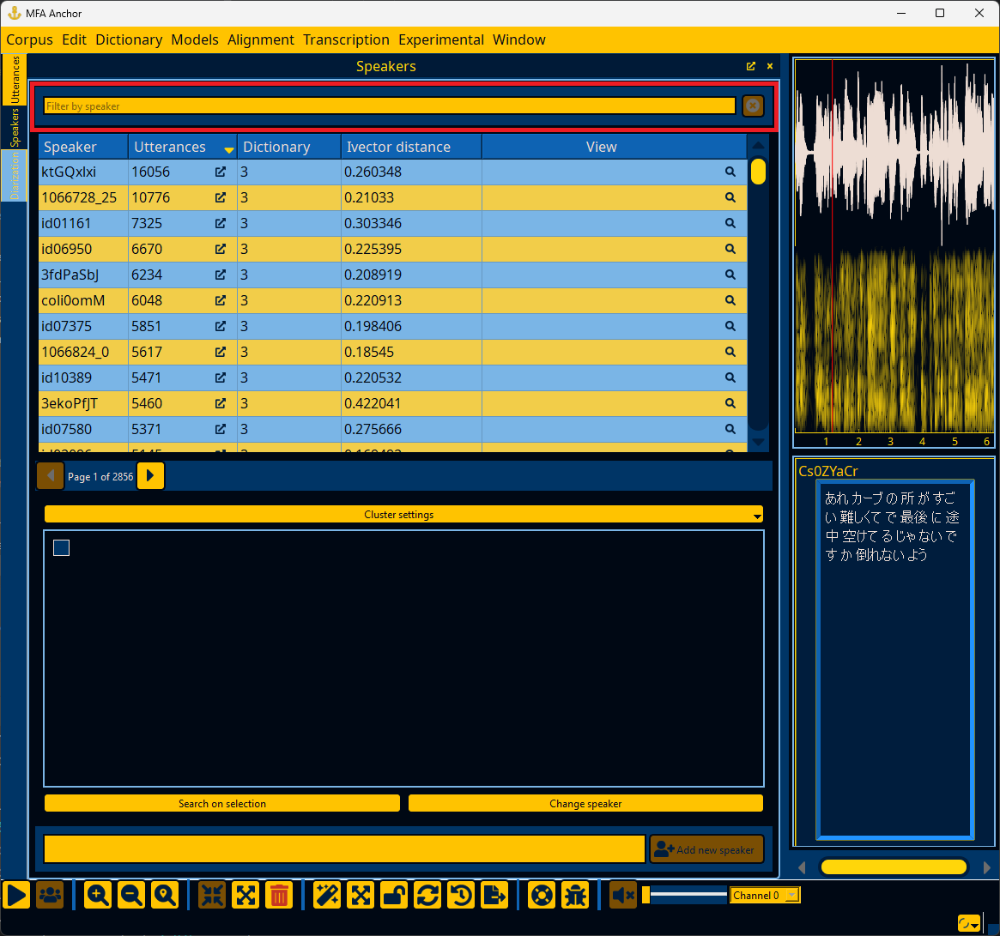
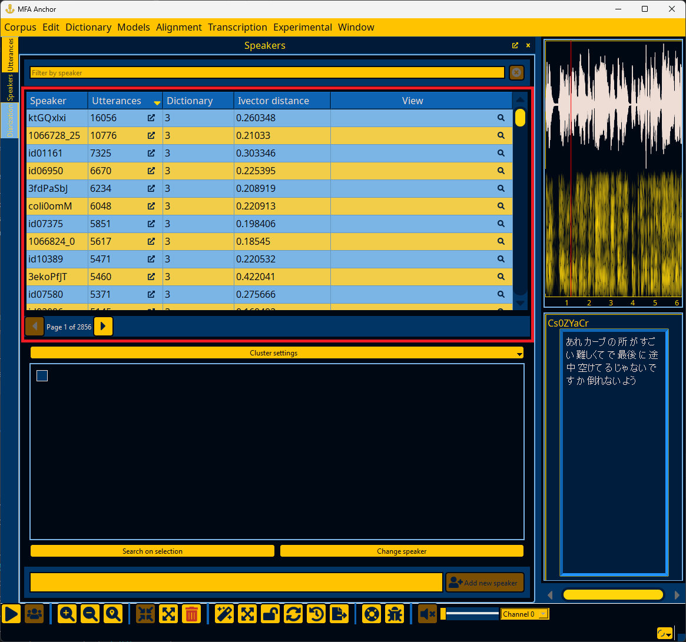
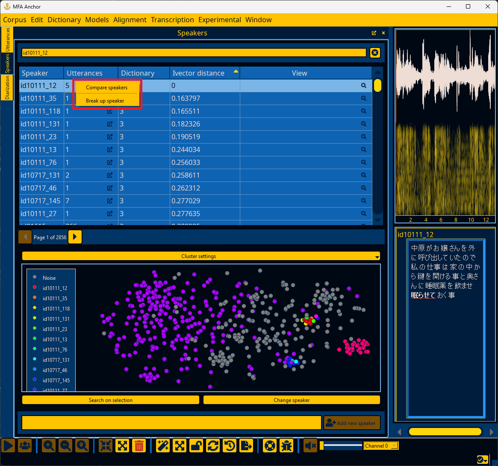
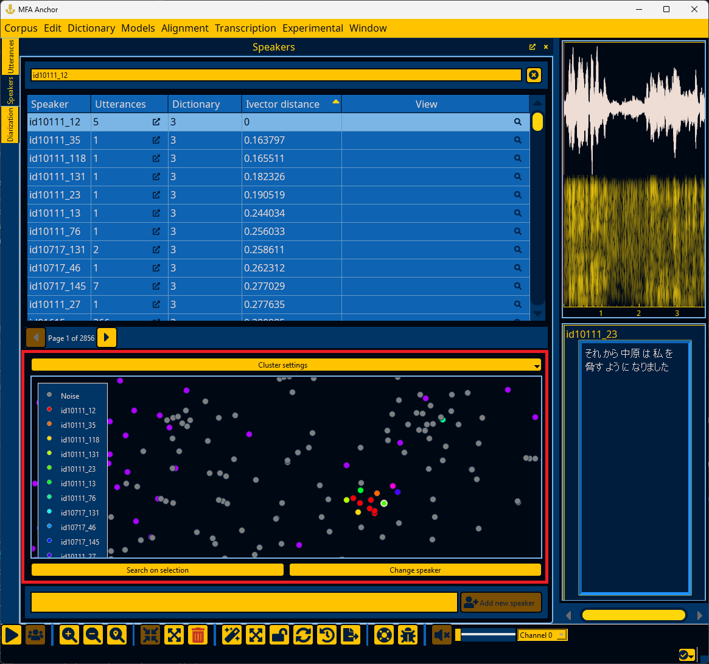
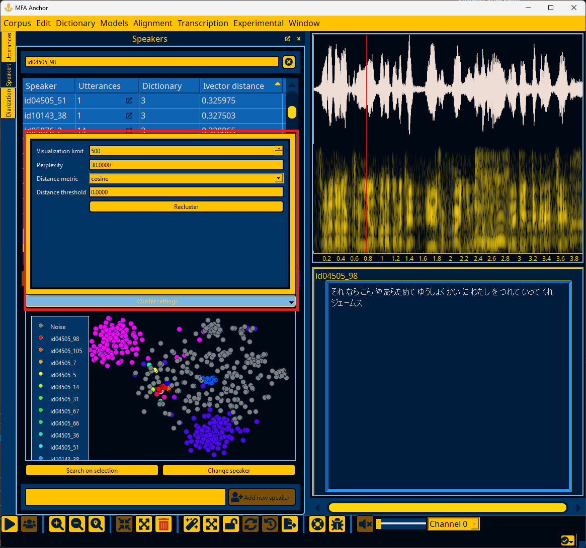
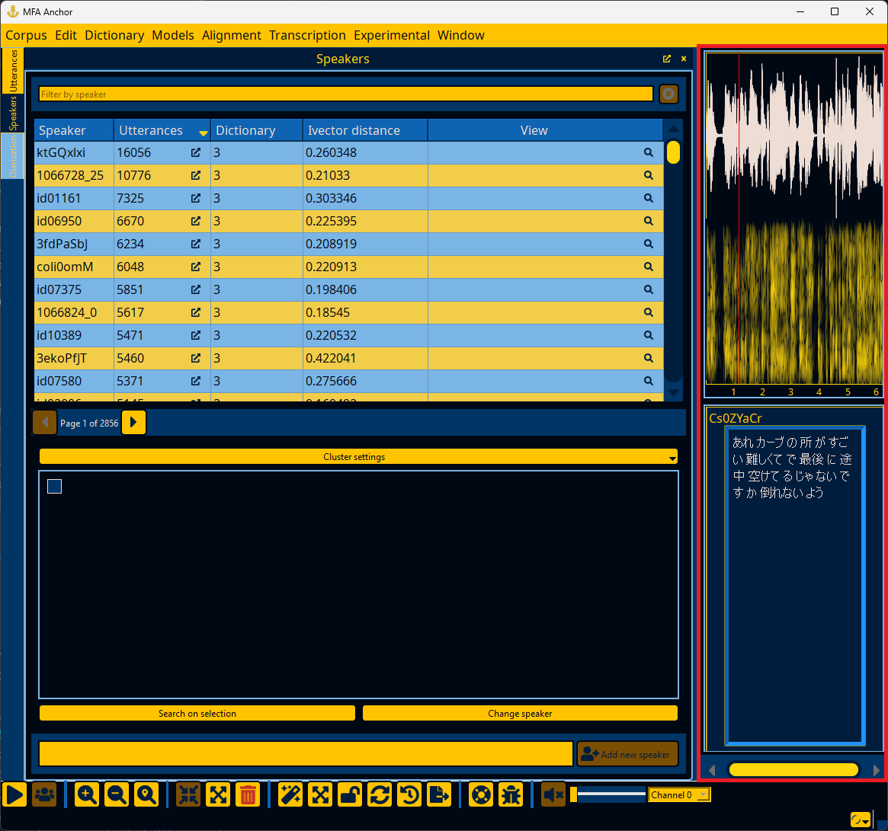
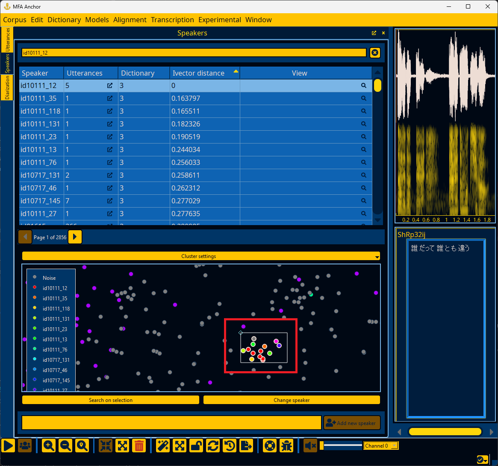
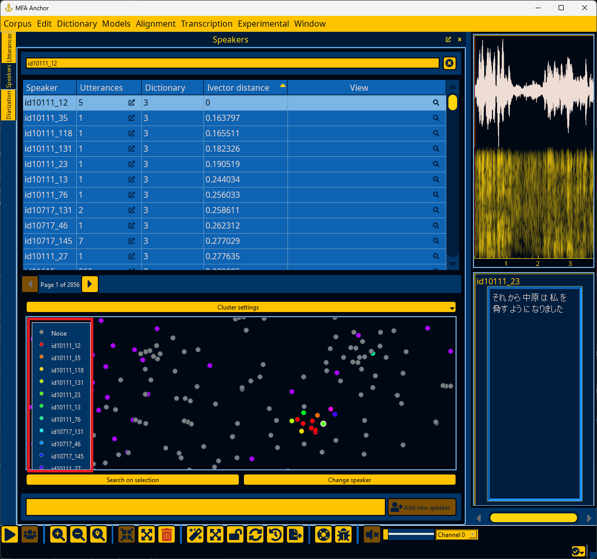
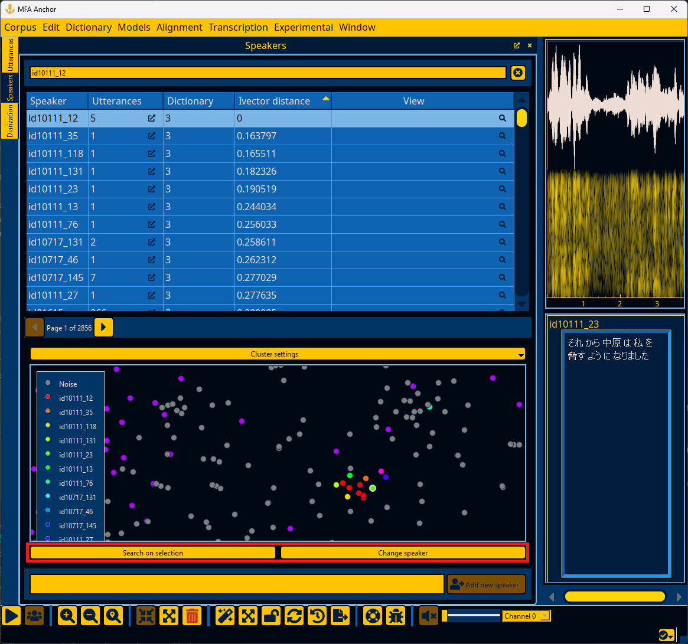

.. _speaker_interface:

*******************
Inspecting speakers
*******************

By default the Speaker window shows speakers ordered by number of utterances, but each column other than "View" can be clicked to cycle sorting on it. If you double click the utterance count :fa:`external-link-alt;sd-text-secondary` of a word, the Utterances window (:ref:`utterance_results`) will pop up and show all utterances for this speaker.

.. warning::

   The functionality related to clustering utterances ("View" button :fa:`magnifying-glass;sd-text-secondary`) for speakers in the Speaker window requires the steps in :ref:`first_steps_diarization`.

.. _speaker_search:

Searching speakers
==================

You can search for specific speakers by typing the name of the speaker.  Typing will provide a dropdown of speakers in the corpus that can be selected as the filter.  Clicking the :fa:`times-solid;sd-text-secondary` button will clear the current speaker filter.

.. _speaker_results:

Speaker search results
======================

If ivectors have been loaded (see :ref:`first_steps_diarization` and :ref:`diarization_interface` for more details), then the "Ivector distance" column will show the average cosine distance from the speaker's utterances to the speaker's mean ivector, if no speaker is specified in the search bar.  If a speaker filter is specified, then the "Ivector distance" column will be the cosine distance between the specified speaker and all other speakers.

Right-clicking on a selection or speaker will bring up a context menu allowing for multiple comparisons of speakers.  This is equivalent to clicking the "View" button for each speaker.  The "Break up speaker" option will create new speakers for each utterance that is currently assigned to that speaker (after a confirmation popup).

If you would like to add a speaker to the corpus, you can specify the name of the speaker and click the "Add new speaker button".  The speaker can be then be assigned to utterances via the :ref:`utterance_context_menus`.

.. _speaker_cluster:

Speaker utterance clustering
============================

.. warning::

   The functionality related to clustering speaker utterances requires the steps in :ref:`first_steps_diarization`.

You can visualize how a speaker's utterances relate to each other and other similar speakers for re-assigning speakers.

Utterance ivectors are clustered using `TSNE <https://scikit-learn.org/stable/modules/generated/sklearn.manifold.TSNE.html>`_ as that has shown the best performance in creating distinct clusters for speakers of the clustering methods. The perplexity can be changed in the "Cluster settings" pop up, along with the distance metric.  Note that :code:`plda` in this case uses cosine distance with PLDA-transformed ivectors.

In addition to the selected speakers for comparison, additional utterances are added to the clustering and are labeled as "Noise". The number of additional utterances is a max of the visualization limit, or the total utterances being visualized.  If a distance threshold is specified, then only those utterances with cosine distance less than the threshold are included.  In addition to the "Noise" utterances, the visualization limit affects how big of a random sample of utterances is included in the TSNE clustering (these are excluded from the the data points returned.  The random sample of utterances is intended impose a bit more a global scale on the clusters, but it does increase the run time of TSNE.

Utterances are represented as dots that can be clicked to bring them up in the right-hand Utterance detail panel.

.. note::

   See :ref:`utterance_toolbar` for actions that can be taken with the selected utterance.

Multiple utterances can be selected by holding shift and dragging the mouse to create a rectangle selection.  Additionally, holding shift/ctrl and clicking dots will toggle selection.

Once utterances are selected, you can change their assigned speaker by clicking the label of the desired speaker in the legend of the cluster plot.  The staged changes will be highlighted.  If you change the utterance to "Noise", then a new speaker will be created for the "Noise" utterances.

However, note that changes have not been committed at this point and you have to click the "Change speaker" button to commit the updates.

You can also select any number of utterances and click "Search on selection" to update the :ref:`speaker_results` window using distance to the average ivector for the current selection.
