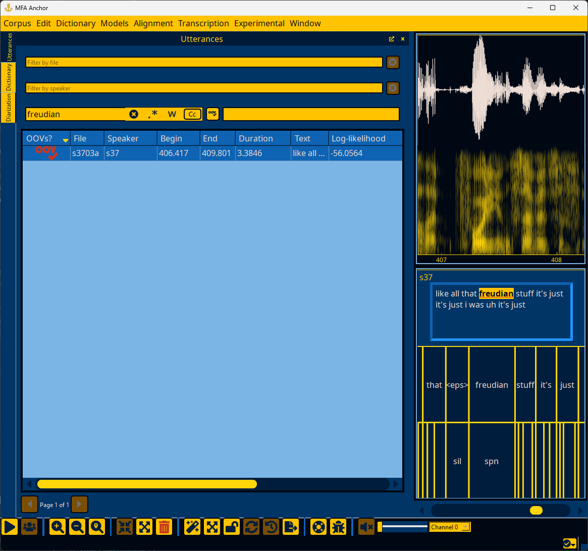
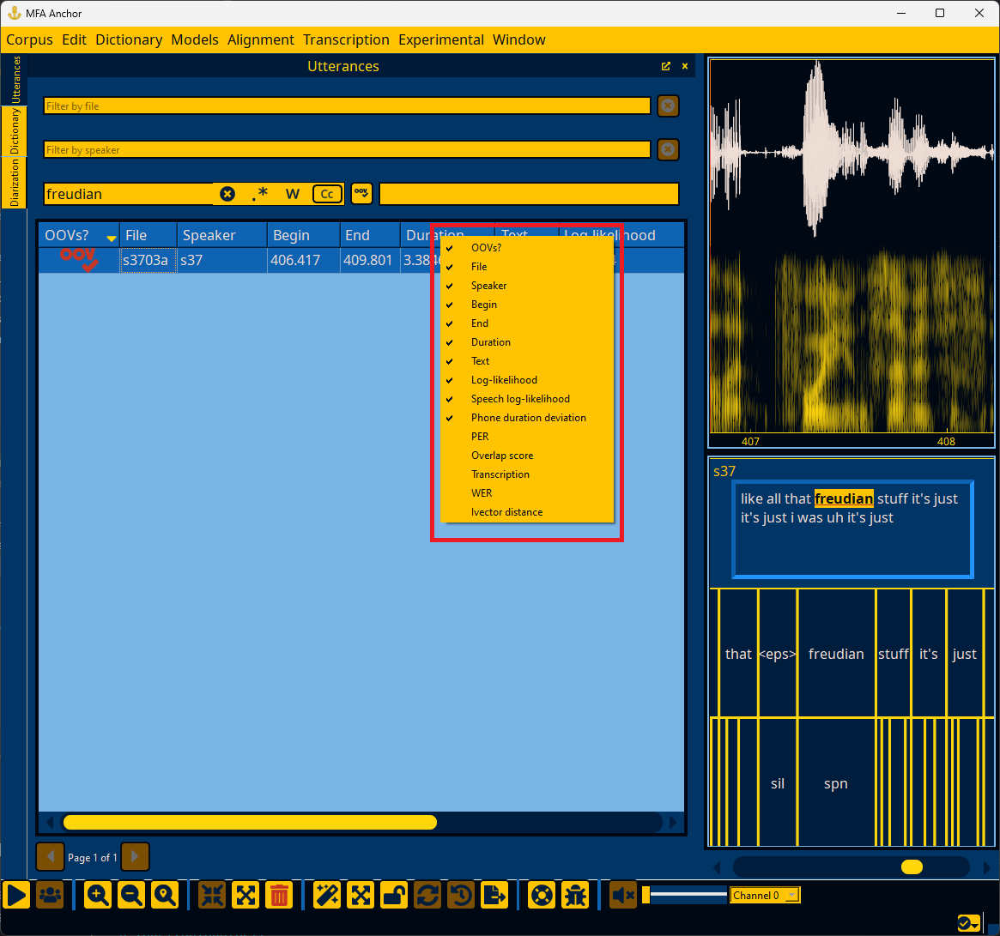
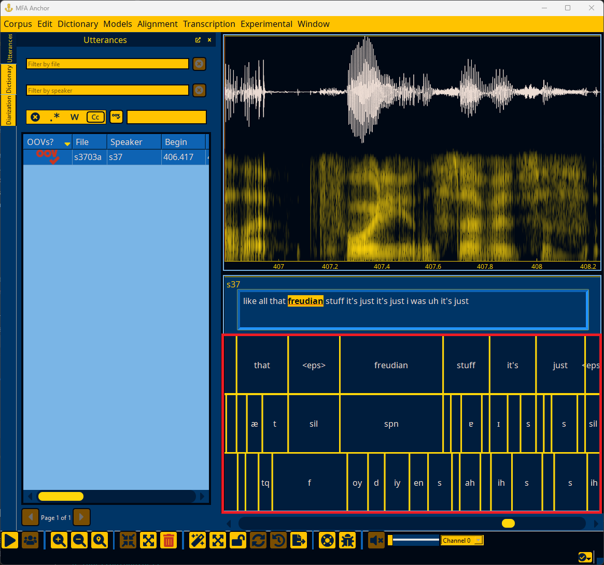
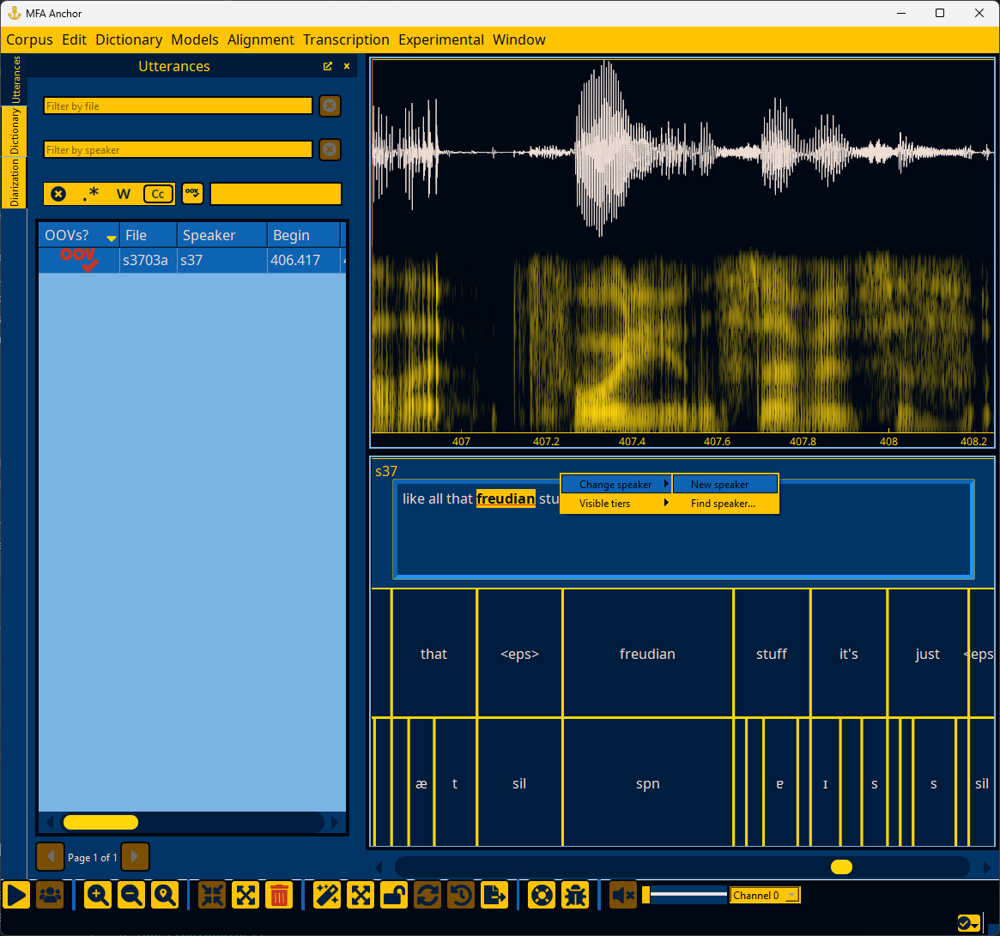
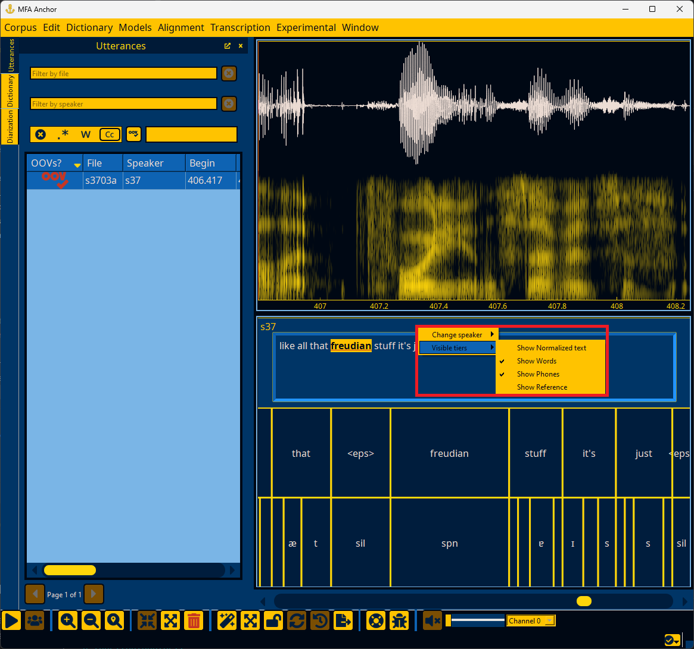
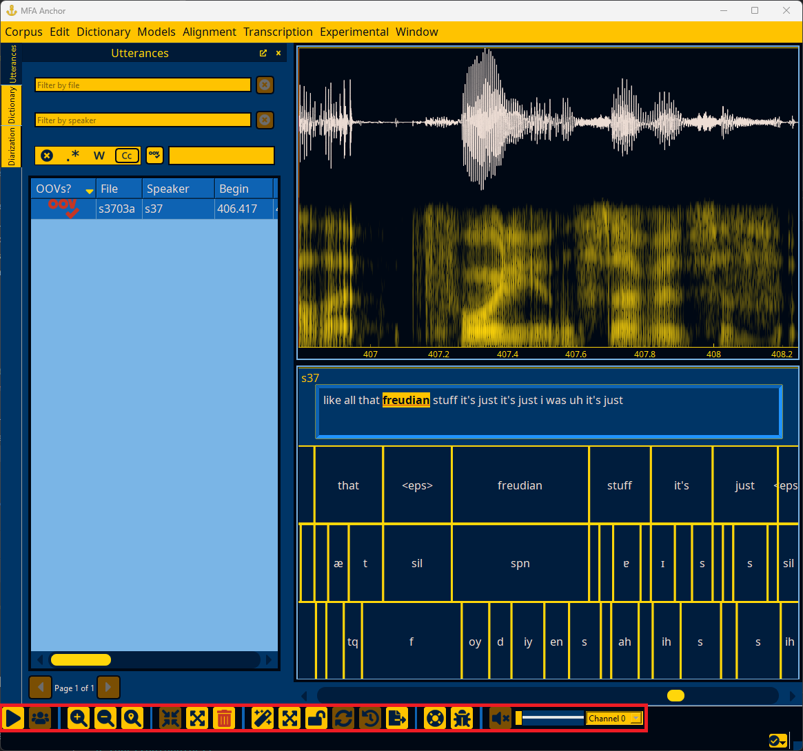
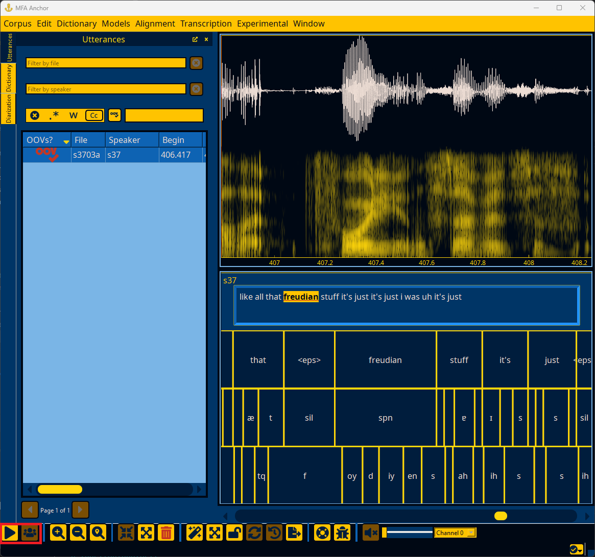
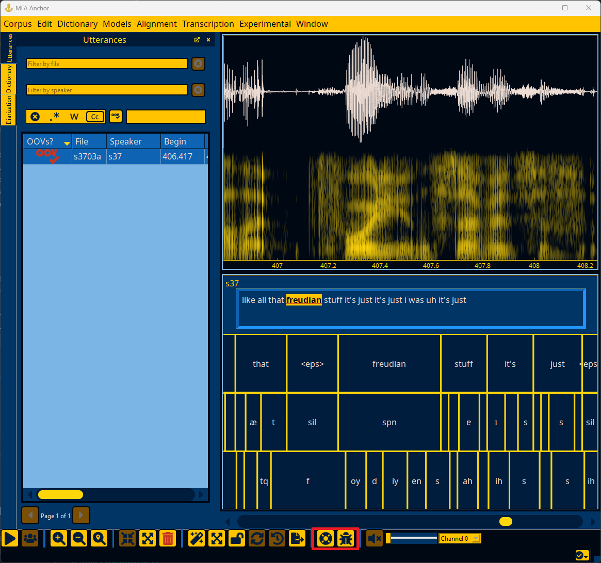

.. _utterance_interface:

*********************
Inspecting utterances
*********************


.. _utterance_search:

Searching utterances
====================

.. figure:: ../_static/img/utterance_search.png
   :align: center

You can search for specific utterances either by file, speaker, or text.  The text search has the capability of using regular expressions.  Additionally, you can use the replace field to replace all instances of a text query with another string in the corpus.  Replacements can also include regular expressions references such as ``\1`` to refer to groups in the search expression.  See the `Python regular expression documentation <https://docs.python.org/3/library/re.html>`_ for more details.


.. _utterance_results:

Utterance search results
========================




The table of utterances contains all search results (or all utterances if there are no filters), and can be sorted according to each column.  The columns contain information about whether it has an OOV (if a pronunciation dictionary has been loaded), the file, speaker, begin, end, duration, and text by default.  By right clicking on the table header, additional columns can be viewed, though they are only relevant once steps like alignment, transcription, or loading ivectors have been done.




.. _utterance_details:

Utterance details
=================


The top right of the Anchor window contains the waveform and spectrogram for the currently selected utterance.

.. note::

   See :ref:`spectrogram_options` and :ref:`pitch_options` for options related to spectrogram and pitch track display.


The bottom left of the Anchor window contains the text transcription of the currently selected utterance, along with additional tiers if steps like alignment or transcription have been performed.  Right clicking on an interval (outside of any text boxes for the transcription) allows for changing the speaker of the utterance or making tiers visible/hidden.



.. _utterance_context_menus:

Utterance context menus
-----------------------

Right-clicking on an utterance outside of the transcript edit box will bring up a context menu for changing the utterance's speaker or changing the visibility of tiers.

You can change the speaker for a given utterance either by selecting a speaker that is already in the file or by specifying a speaker via "Find speaker..." that will bring up a dialog to search speaker names.



You can show/hide tiers for alignment/transcription via the context menu as well. By default, only text and normalized text are available, but by following the steps in :ref:`first_steps_alignment` or :ref:`first_steps_transcription`, more tiers will be listed.  Normalized text is by default hidden, as it is a calculated field based on the text.  Normalized text is what is used as input to alignment as it will perform MFA's clitic analysis or Spacy tokenization.




.. _utterance_toolbar:

Toolbar
-------



The toolbar at the bottom of the Anchor window provides a number of common actions for inspecting, editing, and transforming utterances.

The toolbar contains multiple sections for various types of common actions. Note that these actions also have keyboard shortcuts that can be viewed and customized by :ref:`configure_annotator`.

.. _utterance_toolbar_play:

Utterance playback
``````````````````



The primary action in this section is for playing/pausing the audio (:fa:`play;sd-text-secondary`/:fa:`pause;sd-text-secondary`), by default the keyboard shortcut is ``tab``.

.. _utterance_toolbar_navigation:

Navigating files
````````````````


The utterance view can be zoomed in (:fa:`search-plus;sd-text-secondary`), zoomed out (:fa:`search-minus;sd-text-secondary`), or zoomed to the current selection (:fa:`search-location;sd-text-secondary`).  Zooming can be done via ``ctrl+mouse wheel`` in addition to the keyboard shortcuts in :ref:`configure_annotator`.  Panning can be done via the mouse wheel, keys in :ref:`configure_annotator`, and via the scrollbar below the spectrogram.

.. _utterance_toolbar_edit:

Editing utterances
``````````````````


Utterances can be split in half (:fa:`expand-arrows-alt;sd-text-secondary`), merged into a single utterance (:fa:`compress-arrows-alt;sd-text-secondary`), or deleted (:fa:`trash-alt;sd-text-secondary`).


The advanced functionality is only available when an acoustic model and pronunciation dictionary have been loaded, as they perform alignment.  The alignment action (:fa:`wand-magic-sparkles;sd-text-secondary`) generates an alignment for the utterance, and the segmentation action (:fa:`expand-arrows-alt;sd-text-secondary`) splits the utterance based on VAD and what gets aligned in each segment VAD returns.

The alignment action is similar to `MFA's align_one command <https://montreal-forced-aligner.readthedocs.io/en/latest/user_guide/workflows/alignment.html#align-a-single-file-mfa-align-one>`_ and the segmentation action is similar to `MFA's segment command <https://montreal-forced-aligner.readthedocs.io/en/latest/user_guide/corpus_creation/create_segments.html#segment-transcribed-files-mfa-segment>`_.

.. _utterance_toolbar_help:

Help
````



There are two help actions in the toolbar for opening up Anchor documentation (:fa:`life-ring;sd-text-secondary`) and reporting any issues you've encountered while using Anchor (:fa:`bug;sd-text-secondary`).

.. _utterance_toolbar_output:

Utterance audio output
``````````````````````


